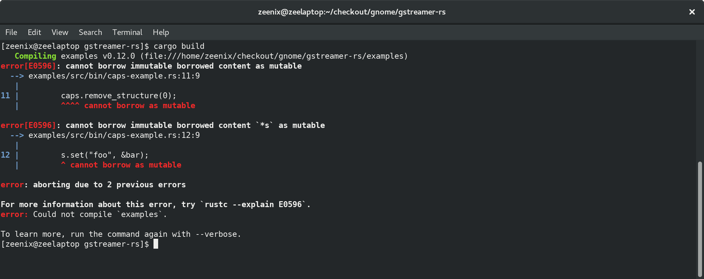
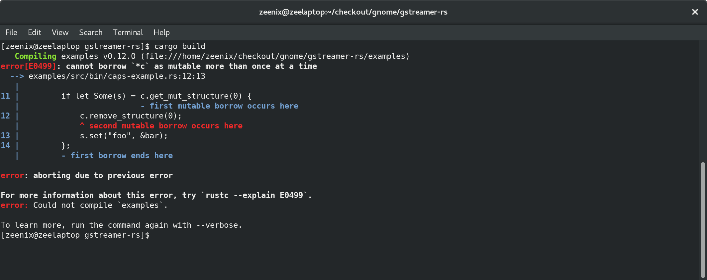
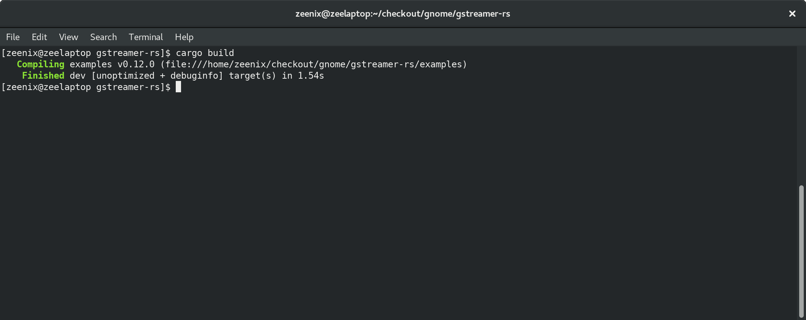

## `Fearless Multimedia Programming`

using GStreamer & Rust

<br/><br/>
zeeshanak@gnome.org


Who am I?


Zeeshan Ali


<!-- .element style="border: 0; background: None; box-shadow: None" -->


FOSS


# 🛨  🚁  🐈


What am I talking about?


Rust + GStreamer


Inspired by Sebastian Dröge's talk


A lot to cover


<!-- .element style="border: 0; background: None; box-shadow: None" -->


Systems programming

<br/>
- Safety
- Efficiency


Zero-cost abstractions


No raw pointers

<br/>
- Deref dangling pointers <span style="color:red">x</span>
- Deref NULL pointers <span style="color:red">x</span>


`unsafe`

<br/>
FFI


Non-mutable state by default

<br/>
```
let x = 5;
let mut y = 5;
```


Strict ownership semantics

<br/>
Not a concept in C/C++


Garbage Collector

<br/>
in other languages


Only one owner
<br/>
```
let s1 = String::from("hello");
let s2 = s1;

println!("{}, world!", s1);
```


Same with functions
<br/>
```
let s1 = String::from("hello");
some_function(s1);

println!("{}, world!", s1);
```


Copy types


You can borrow
<br/>
(Pass by reference in C++)
<br/>

```
let s1 = String::from("hello");
let s2 = &s1;

println!("{}, world!", s2);
println!("{}, world!", s1);
```


But borrows are temporary


`Rc<T>`
<br/>
```
let s1 = Rc::new(String::from("hello"));
let s2 = s1.clone();

println!("{}, world!", s1);
println!("{}, world!", s2);
```


Fearless concurrency


`Arc<T>`


`Mutex<T>`


<!-- .element style="border: 0; background: None; box-shadow: None" -->


Multimedia


Elements & Pipelines<br/>

<!-- .element style="border: 0; background: None; box-shadow: None" -->

Note: Like LEGO, mention pads & caps


An example pipeline<br/>

<!-- .element style="border: 0; background: None; box-shadow: None" -->


Plugin-based


Written in C


Multithreaded

<br/>
- Apps
- Plugins


`OOP using GObject`


Why is Rust relevant?


Parsing media formats not safe

<br/>
Especially from untrusted sources

Note: FLV example


Multithreading is hard!


Mutability & ownership map well
<br/>
<br/>
For example..


GstMiniObject

Read-only on refcount > 1


Avoid memory errors

Note: A whole class of them


C is an archaic language
<br/>
<br/>
Apart from being very unsafe


`GStreamer Rust bindings`

<br/>
- https://github.com/sdroege/gstreamer-rs
- https://github.com/sdroege/gst-plugin-rs


A simple example

```
// caps is a gst::caps::Caps
let s = caps.get_structure(0);
caps.remove_structure(0);
s.set("foo", &bar);
```


<!-- .element style="border: 0; background: None; box-shadow: None;" class="stretch" -->


Let's handle Option

```
if let Some(s) = caps.get_structure(0) {
    caps.remove_structure(0);
    s.set("foo", &bar);
};
```



<!-- .element style="border: 0; background: None; box-shadow: None" -->


Let's solve mutability issue

```
    if let Some(c) = caps.get_mut() {
        if let Some(s) = c.get_mut_structure(0) {
            c.remove_structure(0);
            s.set("foo", &bar);
        };
    };

```



<!-- .element style="border: 0; background: None; box-shadow: None" -->


Now the simultaneous mutability

```
    if let Some(c) = caps.get_mut() {
        c.remove_structure(0);
        if let Some(s) = c.get_mut_structure(0) {
            s.set("foo", &bar);
        };
    };

```



<!-- .element style="border: 0; background: None; box-shadow: None" class="stretch" -->


On a closing note...


No new projects in C/C++ please


That's all folks
