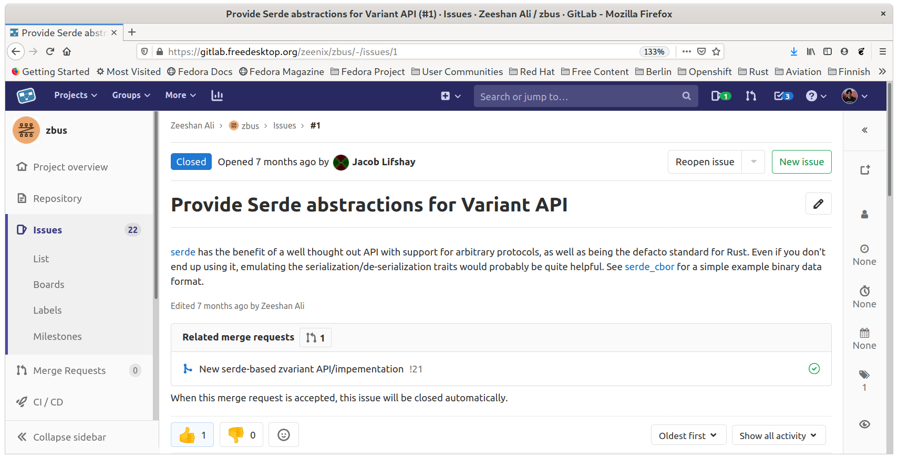

## `Catching up with zbus`

<br/><br/>

<br/><br/>
zeeshanak@gnome.org


Who am I?


Zeeshan Ali

<br/>
🇵🇰 🇫🇮 🇬🇧 🇸🇪  🇩🇪


<!-- .element style="border: 0; background: None; box-shadow: None" -->


Quick recap


zbus


D-Bus


Effecient binary IPC protocol


Wire format


aka GVariant

<br/>
..well almost


Separate crate


zvariant


Since my last presentation


More D-Bus crates


Help me out?


Talking of helping me out..


Marc-André Lureau


<!-- .element style="border: 0; background: None; box-shadow: None" -->


Speed up


Lots of disagreements


Owned vs. Unowned API


Pain points of Rust


2.0 finally happened


serde-based



<!-- .element style="border: 0; background: None; box-shadow: None" -->


```rust
use byteorder::LE;
use zvariant::{from_slice, to_bytes};

// All (de)serialization API needs a context.
let ctxt = zvariant::EncodingContext::<LE>::new_dbus(0);

// strings
let encoded = to_bytes(ctxt, &"hello").unwrap();
let decoded: &str = from_slice(&encoded, ctxt).unwrap();
assert_eq!(decoded, "hello");
```


```rust
// tuples
let t = ("hello", 42i32, true);
let encoded = to_bytes(ctxt, &t).unwrap();
let decoded: (&str, i32, bool) = from_slice(
	&encoded,
	ctxt,
).unwrap();
assert_eq!(decoded, t);
```


```rust
pub fn to_bytes<T>(
    value: &T,
    format: EncodingFormat,
) -> Result<Vec<u8>>
where
    // `Type` trait provides the signature of `T`
    T: Serialize + zvariant::Type;
```


zvariant_derive


```rust
use zvariant::Type;
use zvariant_derive::Type;
use serde::{Deserialize, Serialize};

#[derive(Deserialize, Serialize, Type, PartialEq, Debug)]
struct Struct<'s> {
    field1: u16,
    field2: i64,
    field3: &'s str,
}

assert_eq!(Struct::signature(), "(qxs)");
```


~~But don't use it just yet!~~


Use away!!


GVariant support underway


Experimental branch


Not very useful w/o GVariant support


zbus


Close to 1.0


lowlevel API


Sending & receiving messages


```rust
let mut connection = zbus::Connection::new_session().unwrap();

let reply = connection
	.call_method(
			Some("org.gnome.SettingsDaemon.Power"),
			"/org/gnome/SettingsDaemon/Power",
			Some("org.gnome.SettingsDaemon.Power.Screen"),
			"StepUp",
			&(),
	) 
	.unwrap();
 
let (percent, _)  = reply.body::<(u32, &str)>().unwrap();
println!("New level: {}%", percent);
```


Highlevel API


Proxy and ObjectServer


zbus_derive


Client-side

```rust
#[dbus_proxy]
trait Notifications {
    fn notify(&self,
              app_name: &str,
              replaces_id: u32,
              app_icon: &str,
              summary: &str,
              body: &str,
              actions: &[&str],
              hints: HashMap<&str, &Value>,
              expire_timeout: i32) -> zbus::Result<u32>;
}
```


```rust
let connection = zbus::Connection::new_session()?;

let proxy = NotificationsProxy::new(&connection)?;

let _reply = proxy.notify(
	"my-app",
	0,
	"dialog-information",
	"A summary", "Some body",
	&[],
	HashMap::new(),
	5000,
)?;
```


Server-side

```rust
#[dbus_interface(name = "org.zbus.MyGreeter1")]
impl Greeter {
    fn say_hello(&self, name: &str) -> String {
        format!("Hello {}!", name)
    }
}
```


```rust
let connection = zbus::Connection::new_session()?;

let mut object_server = zbus::ObjectServer::new(&connection);
object_server.at(&"/org/zbus/MyGreeter".try_into()?, Greeter);

loop {
	if let Err(err) = object_server.try_handle_next() {
		eprintln!("{}", err);
	}
}
```


XML ↔ Code


Book

<BR/>
https://zeenix.pages.freedesktop.org/zbus


Documentation & polish


🙌 1.0 🙌


Post-1.0


Async


That's all folks

<br/>
<br/>
https://gitlab.freedesktop.org/zeenix/zbus
