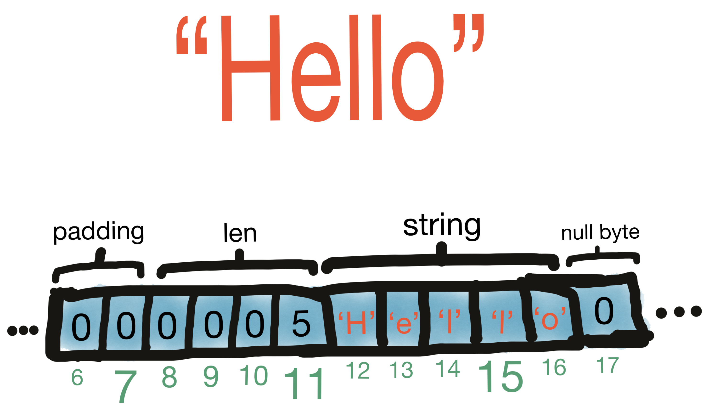
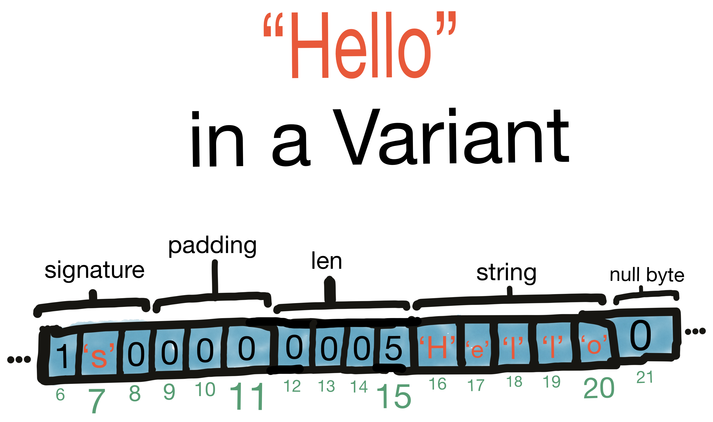
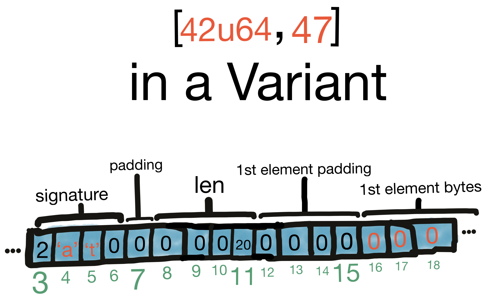
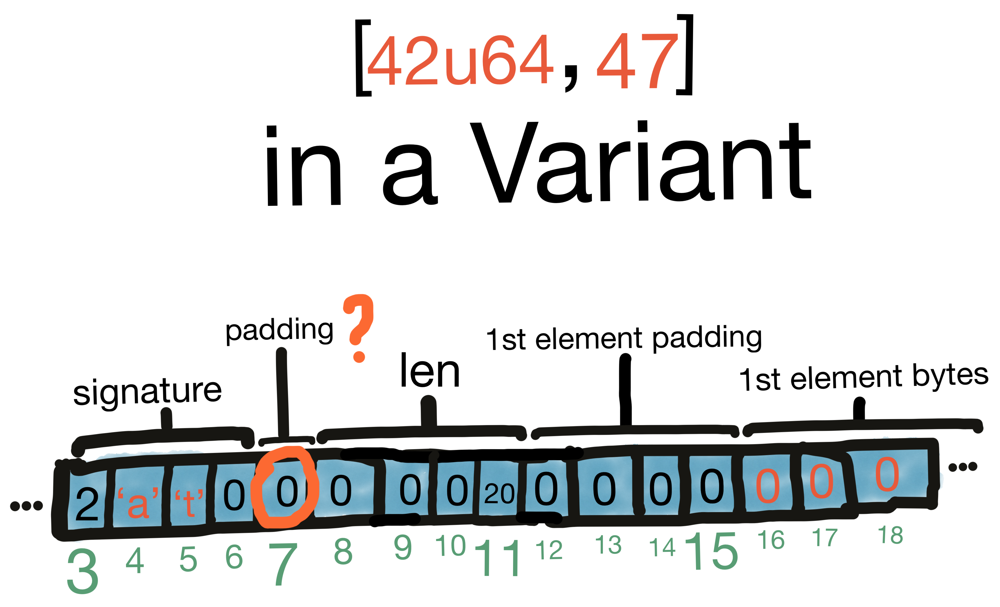
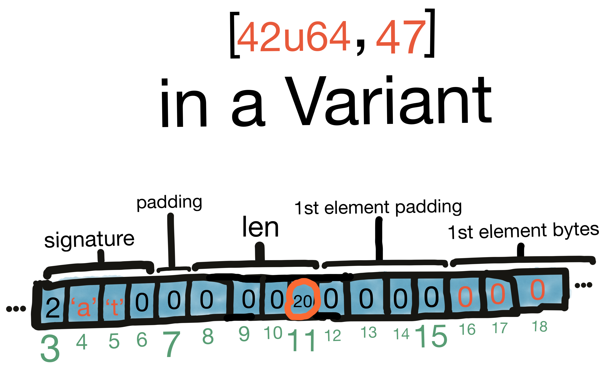
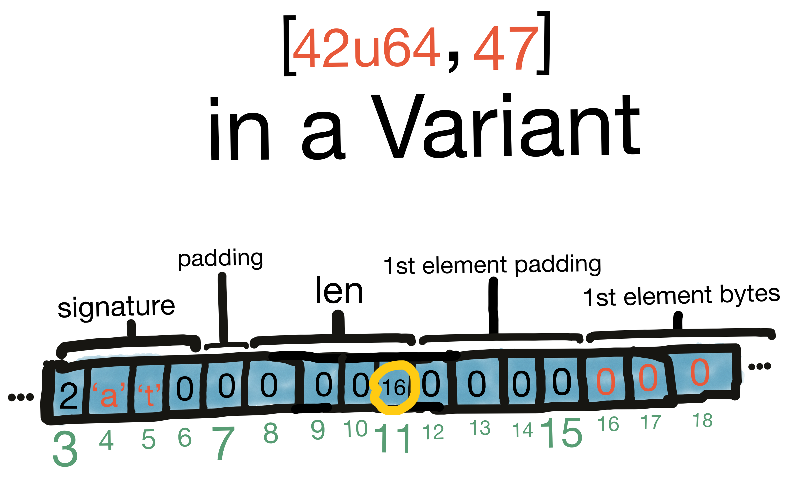
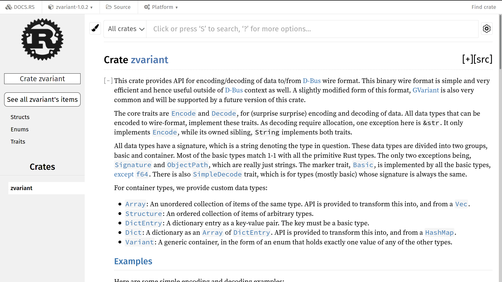
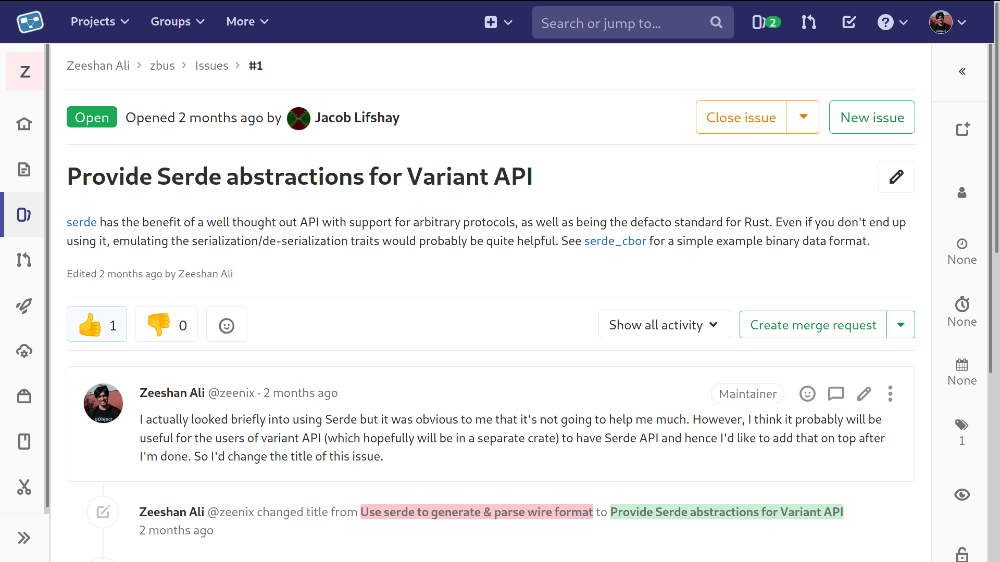

## `zbus`

<br/><br/>
Yet another D-Bus library

<br/><br/>
zeeshanak@gnome.org


Who am I?


Zeeshan Ali

<br/>
🇵🇰 ➡ 🇫🇮 ➡ 🇬🇧  ➡ 🇸🇪 ➡  🇩🇪
<br/>
<br/>
<br/>
🎶 Mun koti ei oo täällä 🎶


<!-- .element style="border: 0; background: None; box-shadow: None" -->


FOSS


# 🛨  🚁  🐈


Background story

<br/>
Or recap for some


Geoclue


Geolocation service


Written in C


Maintainer since Geoclue2


Let's oxidize it!


But why?


Crash reports


Most sensitive data


I <span style="color:red">❤️ </span> Rust


Challenges


Meson


D-Bus


Effecient binary IPC protocol


Desktop & embedded


dbus-rs


libdbus


Issues

Note: Multiple async APIs, no CI etc


Still decided to use


Even contributed


Rust GNOME Hackfest, May 2019


dbus-rs API over-complicated


D-Bus crate from scratch?? 😯


How hard can it be? 😂


What's involved?


High-level


Objects

```
/org/freedesktop/GeoClue2/Manager
/org/freedesktop/GeoClue2/Client
/org/freedesktop/GeoClue2/Location/0
/org/freedesktop/GeoClue2/Location/1
...
```


Interfaces

```
org.freedesktop.GeoClue2.Manager
org.freedesktop.GeoClue2.Client
org.freedesktop.GeoClue2.Location
...
```


Methods

```
org.freedesktop.GeoClue2.Manager.GetClient(OUT o client)
org.freedesktop.GeoClue2.Client.Start()
org.freedesktop.GeoClue2.Client.Stop()
```


Signals

```
org.freedesktop.GeoClue2.Client.LocationUpdated(o old, o new)
```


Properties

```
org.freedesktop.GeoClue2.Location.Latitude
org.freedesktop.GeoClue2.Location.Longitude
org.freedesktop.GeoClue2.Location.Altitude
```


Low-level


Message passing 📨


Wire format


aka GVariant

<br/>
..well almost


Used standalone as well

<br/>
OSTree, Flatpak, dconf


Intro to the Wire format


Data types & encoding


Natural alignment


Signature ✍


Basic types

<br/>
u8, i16, f64, str, etc


Containers


Array, Structure, Dict

<br/>
and..


Variant

Note: Generic data



<!-- .element style="border: 0; background: None; box-shadow: None" -->



<!-- .element style="border: 0; background: None; box-shadow: None" -->


Actually..really not too hard

Note: assumptions


After 3 days...


Established a connection!


Called a method


Cool, let's really do this!


zbus!


But hardest part first


zvariant


Good goal

<br/>
Super efficient API


Silly goal

<br/>
Super efficient from day 1


```rust
trait VariantType<'a>: Sized {
    const SIGNATURE: char;
    const ALIGNMENT: u32;

    fn decode(bytes: &'a [u8], signature: &str)
        -> Result<Self, VariantError>;
    fn encode(&self) -> Vec<u8>;

    fn signature<'b>(&'b self) -> Cow<'b, str> {
        Cow::from(Self::SIGNATURE_STR)
    }
```
Note: SIGNATURE & signature same for basic types


Lots of issues


Loads of fun with lifetimes


Variant representation was challenging


But eventually..


Started to look really good

Note: docs and ship


Wait! Why the new test cases fail?



<!-- .element style="border: 0; background: None; box-shadow: None" -->


Couldn't figure out for many days


Back to D-Bus spec reading



<!-- .element style="border: 0; background: None; box-shadow: None" -->


Complete overhaul needed


Lifetimes made it very hard


🗡 Kill all lifetimes!!! 🗡

<br/>
```rust
// Immutable slice of an underlying byte buffer.
pub struct SharedData {
    data: Rc<Vec<u8>>,
    position: usize,
    end: usize,
}
```


Efficiency is not a religion

Note: No need to be more efficient than C


Done after 2 more months


All test cases now pass?


Nope!!! 😭


More spec reading & bytes staring



<!-- .element style="border: 0; background: None; box-shadow: None" -->



<!-- .element style="border: 0; background: None; box-shadow: None" -->


Trivial to fix


🎄 holiday well spent


zvariant published!


<!-- .element style="border: 0; background: None; box-shadow: None" -->


```rust
use zvariant::{Encode, EncodingFormat, SimpleDecode};

// Encode a string
let format = EncodingFormat::default();
let encoding = "Hello world!".encode(format);
assert!(encoding.len() == 17);

// and the decode it from the encoded form
let s = String::decode_simple(encoding, format).unwrap();
assert!(s == "Hello world!");
```


```rust
use zvariant::{Decode, Encode, EncodingFormat, Variant};

// Create a Variant from an i16 and encode it
let v = i16::max_value().to_variant();
let format = EncodingFormat::default();
let encoding = v.encode_value(format);

// Decode it back
let v = Variant::from_data(encoding, 'n', format).unwrap();
assert_eq!(
    i16::take_from_variant(v).unwrap(),
    i16::max_value()
);
```


But don't use it just yet!


Back to efficiency

Note: Fine for D-Bus 


API breakage needed


Serde


<!-- .element style="border: 0; background: None; box-shadow: None" -->


Experimental branch


Main challenge: Too generic


PoC Serializer impl


```rust
pub fn to_bytes<T>(
    value: &T,
    format: EncodingFormat,
) -> Result<Vec<u8>>
where
    // `VariantValue` trait provides the signature of `T`
    T: Serialize + VariantValue;
```


What's the point then?


Even if derive macro provided

<br/>
```rust
#[derive(Serialize, Deserialize, VariantValue)]
pub struct YourType {
...
```


So..


`VariantValue` trait bound


Deserializer next


Configurable byte order


GVariant


& a few other goodies like..


Large array handling


Back to D-Bus


You can already do:

<br/>
```rust
let mut conection = zbus::Connection::new_session().unwrap();
let reply = connection
    .call_method(
        Some("org.freedesktop.DBus"),
        "/org/freedesktop/DBus",
        Some("org.freedesktop.DBus.Peer"),
        "GetMachineId",
        None,
    )
    .unwrap();
let body = reply.body(Some(<&str>::SIGNATURE_STR)).unwrap();
let v = body.get(0).unwrap();
let id = v.get::<&str>().unwrap();
println!("Machine ID: {}", id);
```


Looking forward


Receiving messages


Signals


Async

Note: async-std


High-level API
<br/>
<br/>
Objects & Methods


Code generation


Maybe also macros


& way too much of easy!


That's all folks

<br/>
<br/>
https://gitlab.freedesktop.org/zeenix/zbus
