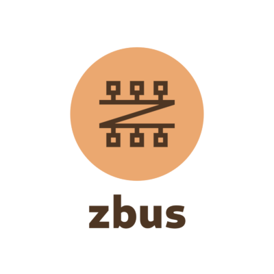

<!-- .element style="border: 0; background: None; box-shadow: None" -->

<br/><br/>
Why oh why? also how?

<br/><br/>
zeeshanak@gnome.org


Who am I?


Zeeshan Ali

<br/>
🇵🇰 🇫🇮 🇬🇧 🇸🇪  🇩🇪


<!-- .element style="border: 0; background: None; box-shadow: None" -->


FOSS


# 🛩 🚁 🐈


Background story


Geoclue


Geolocation D-Bus service


What's D-Bus?? 🤔


Effecient binary IPC protocol


Desktop & embedded


systemd, GNOME & KDE etc


Written in C


<!-- .element style="border: 0; background: None; box-shadow: None" -->

Let's oxidize it!


But why?


Crash reports


Most sensitive data


I <span style="color:red">❤️ </span> Rust


How do you talk D-Bus?


There must be a crate for it!


dbus-rs


libdbus 🙄


Issues

Note: Multiple async APIs, no CI etc


Still decided to use


Even contributed


Rust GNOME Hackfest, May 2019


dbus-rs API over-complicated


D-Bus crate from scratch?? 😯


How hard can it be? 😂


What's involved?


Low-level


Message passing


Wire format


<br/>
aka GVariant


Data types & encoding


Map nicely to Rust types


High-level


Objects

```
/org/freedesktop/GeoClue2/Manager
/org/freedesktop/GeoClue2/Client
/org/freedesktop/GeoClue2/Location/0
/org/freedesktop/GeoClue2/Location/1
...
```


Interfaces

```
org.freedesktop.GeoClue2.Manager
org.freedesktop.GeoClue2.Client
org.freedesktop.GeoClue2.Location
...
```


Methods

```
org.freedesktop.GeoClue2.Manager.GetClient(OUT o client)
org.freedesktop.GeoClue2.Client.Start()
org.freedesktop.GeoClue2.Client.Stop()
```


Signals

```
org.freedesktop.GeoClue2.Client.LocationUpdated(o old, o new)
```


Properties

```
org.freedesktop.GeoClue2.Location.Latitude
org.freedesktop.GeoClue2.Location.Longitude
org.freedesktop.GeoClue2.Location.Altitude
```


Actually..really not too hard

Note: assumptions


Cool, let's really do this!


zbus!


Goals


Easy


Efficient


But first things first


zvariant


Spent several months


Different approaches


Fun with lifetimes


And D-Bus spec itself


zvariant 1.0


❌ Empty Arrays ❌


Why not serde?


Another few months of fun


zvariant 2.0


```rust
use zvariant::{from_slice, to_bytes, EncodingContext};

// All (de)serialization API needs a context.
let ctxt = EncodingContext::<byteorder::LE>::new_dbus(0);

let t = ("hello", 42i32, true);
let encoded = to_bytes(ctxt, &t)?;
let decoded: (&str, i32, bool) = from_slice(&encoded, ctxt)?;
assert_eq!(decoded, t);
```


Back to D-Bus


Slow progress at first


More D-Bus crates 😮


Help me out?


An old friend to the rescue


<!-- .element style="border: 0; background: None; box-shadow: None" -->

Marc-André Lureau


Speed up


Lots of disagreements


🙌 1.0 🙌<br/><br/>


Well-received


<!-- .element class="r-stretch" style="border: 0; background: None; box-shadow: None" -->


<!-- .element class="r-stretch" style="border: 0; background: None; box-shadow: None" -->


How does it look like?


```rust
let mut connection = zbus::Connection::new_session()?;

let reply = connection
	.call_method(
			Some("org.gnome.SettingsDaemon.Power"),
			"/org/gnome/SettingsDaemon/Power",
			Some("org.gnome.SettingsDaemon.Power.Screen"),
			"StepUp",
			&(),
	)?;

let (percent, _)  = reply.body::<(u32, &str)>()?;
println!("New level: {}%", percent);
```


Pretty easy aleady


But we can do better


High-level API


Client-side


```rust
#[dbus_proxy]
trait Notifications {
    fn notify(&self,
              app_name: &str,
              replaces_id: u32,
              app_icon: &str,
              summary: &str,
              body: &str,
              actions: &[&str],
              hints: HashMap<&str, &Value>,
              expire_timeout: i32) -> zbus::Result<u32>;
}
```


```rust
let proxy = NotificationsProxy::new(&connection)?;

let _reply = proxy.notify(
	"my-app",
	0,
	"dialog-information",
	"Hi!!",
	"Yes, you! How are things?",
	&[],
	HashMap::new(),
	5000,
)?;
```


Signals and Properties


```rust
#[dbus_proxy(
    default_service = "org.freedesktop.GeoClue2",
    interface = "org.freedesktop.GeoClue2.Client"
)]
trait Client {
    /// A property setter.
    #[dbus_proxy(property)]
    fn set_desktop_id(&mut self, id: &str) -> Result<()>;

    /// A property getter.
    #[dbus_proxy(property)]
    fn desktop_id(&mut self) -> Result<String>;
}
```


```rust
    /// A signal.
    #[dbus_proxy(signal)]
    fn location_updated(
        &self,
        old: ObjectPath,
        new: ObjectPath,
    ) -> Result<()>;
```


```rust
client.set_desktop_id("org.freedesktop.zbus").unwrap();

client
    .connect_location_updated(move |_old, new| {
        println!("old location: {}", old);
        println!("new location: {}", new);

        Ok(())
    })
    .unwrap();

// Wait till there is a signal that was handled.
while client.next_signal().unwrap().is_some() {}
```


Server-side


```rust
#[dbus_interface(name = "org.zbus.MyGreeter1")]
impl Greeter {
    fn say_hello(&self, name: &str) -> String {
        format!("Hello {}!", name)
    }
}
```


```rust
use zbus::ObjectServer;

let mut server = ObjectServer::new(&connection);
server.at(&"/org/zbus/MyGreeter".try_into()?, Greeter);

loop {
	if let Err(err) = server.try_handle_next() {
		eprintln!("{}", err);
	}
}
```


Still not easy enough?


```shell
$ cargo install zbus_xmlgen
$ zbus-xmlgen --system \
    org.freedesktop.login1 \
    /org/freedesktop/LogControl1
$ zbus-xmlgen --session \
    org.freedesktop.ScreenSaver \
    /org/freedesktop/ScreenSaver
$ zbus-xmlgen interface.xml
```


Book<br/><br/>

https://dbus.pages.freedesktop.org/zbus/1.0/


No asynchronous API? 🙄


⚔ Async runtimes wars ⚔


☑ Lowlevel


```rust [1,10]
let mut conn = zbus::azync::Connection::new_session()?;

let reply = conn
	.call_method(
			Some("org.gnome.SettingsDaemon.Power"),
			"/org/gnome/SettingsDaemon/Power",
			Some("org.gnome.SettingsDaemon.Power.Screen"),
			"StepUp",
			&(),
	).await?;

let (percent, _)  = reply.body::<(u32, &str)>()?;
println!("New level: {}%", percent);
```


☑ Client-side


```rust [1,12]
let proxy = AsyncNotificationsProxy::new(&connection)?;

let _reply = proxy.notify(
	"my-app",
	0,
	"dialog-information",
	"Hi!!",
	"Yes, you! How are things?",
	&[],
	HashMap::new(),
	5000,
).await?;
```


Signals and Properties


```rust [3,6,14]
    client
        .set_desktop_id("org.freedesktop.zbus")
        .await?;
    client
        .connect_location_updated(move |old, new| {
            async move {
                println!("old location: {}", old);
                println!("new location: {}", new);

                Ok(())
            }
            .boxed()
        })
        .await?;
```


```rust
    while client.next_signal().await?.is_some() {}
```


Streams


Server-side: Coming soon..


🙌 2.0 🙌<br/><br/>

beta releases available


That's all folks


<!-- .element style="border: 0; background: None; box-shadow: None" -->

https://gitlab.freedesktop.org/dbus/zbus
