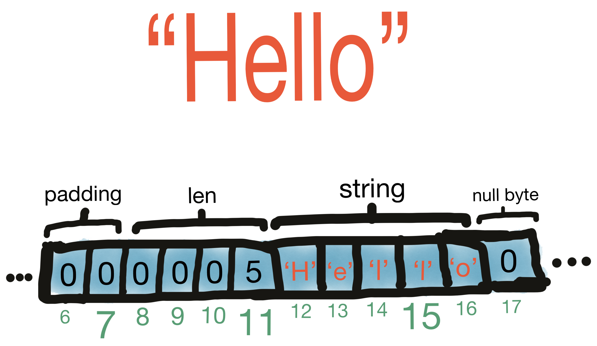
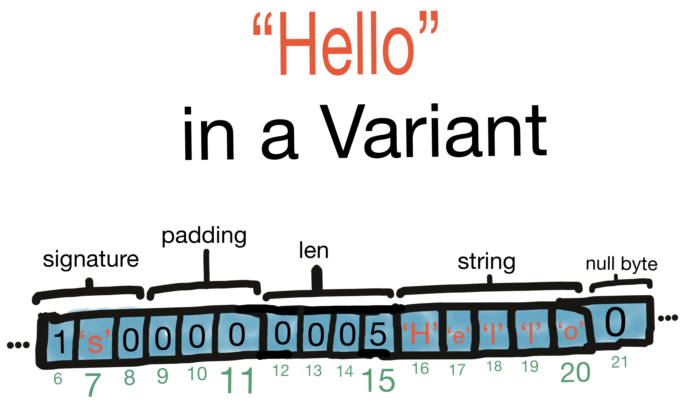
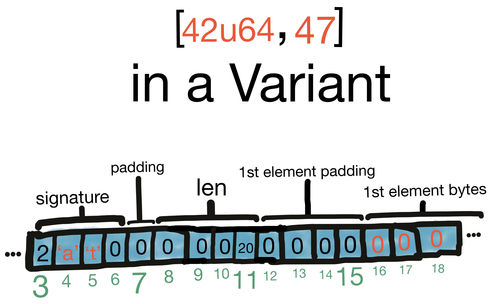
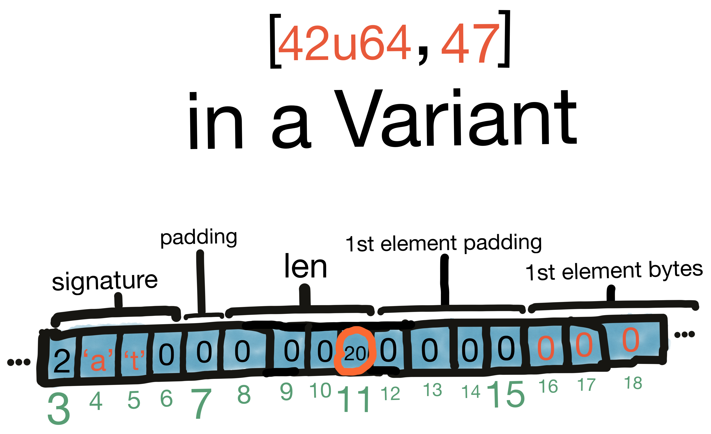
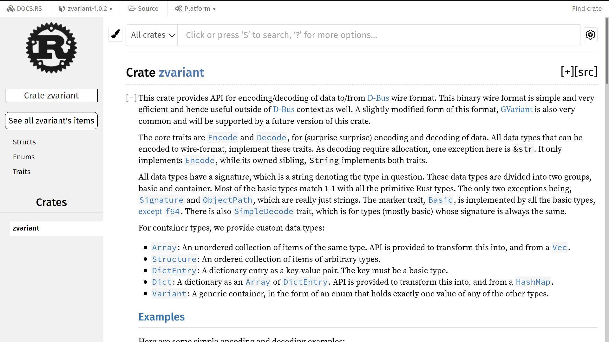

## `zvariant`

<br/><br/>
A cool new crate you shouldn't use YET
<br/><br/>
zeeshanak@gnome.org


Who am I?


Zeeshan Ali

<br/>
🇵🇰 🇫🇮 🇬🇧 🇸🇪  🇩🇪


<!-- .element style="border: 0; background: None; box-shadow: None" -->


Background

<br/>
Or recap for some


zbus


D-Bus


Effecient binary IPC protocol


Wire format


aka GVariant

<br/>
..well almost


For example


Ostree


Flatpak


dconf


Separate crate


zvariant


Intro to the Wire format


Data types & encoding


Natural alignment


Signature


Basic types

<br/>
u8, i16, f64, str, etc


Containers


Array, Structure, Dict

<br/>
and..


Variant

Note: Generic data



<!-- .element style="border: 0; background: None; box-shadow: None" -->



<!-- .element style="border: 0; background: None; box-shadow: None" -->


Good goal

<br/>
Super efficient API


Silly goal

<br/>
Super efficient from day 1


```rust
trait VariantType<'a>: Sized {
    const SIGNATURE: char;
    const ALIGNMENT: u32;

    fn decode(bytes: &'a [u8], signature: &str)
        -> Result<Self, VariantError>;
    fn encode(&self) -> Vec<u8>;

    fn signature<'b>(&'b self) -> Cow<'b, str> {
        Cow::from(Self::SIGNATURE_STR)
    }
```
Note: SIGNATURE & signature same for basic types


Lots of issues


Loads of fun with lifetimes


Variant representation was challenging


But eventually..


Started to look really good

Note: docs and ship


Wait! Why the new test cases fail?



<!-- .element style="border: 0; background: None; box-shadow: None" -->


Couldn't figure out for many days


Back to D-Bus spec reading


<!-- .element style="border: 0; background: None; box-shadow: None" -->


Complete overhaul needed


Lifetimes made it very hard


🗡 Kill all lifetimes!!! 🗡

<br/>
```rust
// Immutable slice of an underlying byte buffer.
pub struct SharedData {
    data: Rc<Vec<u8>>,
    position: usize,
    end: usize,
}
```


Done after 2 months


All test cases now pass?


Nope!!! 😭


More spec reading & bytes staring



<!-- .element style="border: 0; background: None; box-shadow: None" -->


<!-- .element style="border: 0; background: None; box-shadow: None" -->


Trivial to fix


🎄 holiday well spent


zvariant published!


<!-- .element style="border: 0; background: None; box-shadow: None" -->


```rust
use zvariant::{Encode, EncodingFormat, SimpleDecode};

// Encode a string
let format = EncodingFormat::default();
let encoding = "Hello world!".encode(format);
assert!(encoding.len() == 17);

// and the decode it from the encoded form
let s = String::decode_simple(encoding, format).unwrap();
assert!(s == "Hello world!");
```


```rust
use zvariant::{Decode, Encode, EncodingFormat, Variant};

// Create a Variant from an i16 and encode it
let v = i16::max_value().to_variant();
let format = EncodingFormat::default();
let encoding = v.encode_value(format);

// Decode it back
let v = Variant::from_data(encoding, 'n', format).unwrap();
assert_eq!(
    i16::take_from_variant(v).unwrap(),
    i16::max_value()
);
```


But don't use it just yet!


Back to efficiency

Note: Fine for D-Bus 


API breakage needed


Serde


<!-- .element style="border: 0; background: None; box-shadow: None" -->


Experimental branch


PoC Serializer impl


Main challenge: Too generic


```rust
pub fn to_bytes<T>(
    value: &T,
    format: EncodingFormat,
) -> Result<Vec<u8>>
where
    // `VariantValue` trait provides the signature of `T`
    T: Serialize + VariantValue;
```


Will provide derive macro

<br/>
```rust
#[derive(Serialize, Deserialize, VariantValue)]
pub struct YourType {
...
```


Deserializer next


Configurable byte order


GVariant


& a few other goodies like..


Large array handling


Then back to zbus


That's all folks

<br/>
<br/>
https://gitlab.freedesktop.org/zeenix/zbus
